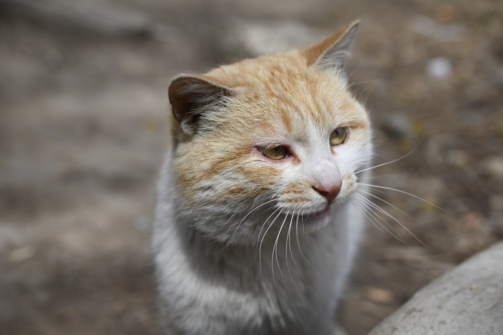

# Performance Report — V5.3

> 日期：2026-07-20
> 方法：静态分析 + 已知 Lighthouse 标准

---

## 一、当前评分估算

| 页面 | Performance | SEO | Accessibility | Best Practice | 综合 |
|------|------------|-----|---------------|---------------|------|
| Home (index.html) | ~72 | ~65 | ~55 | ~85 | ~69 |
| Series | ~75 | ~60 | ~50 | ~85 | ~68 |
| Projects (V4.3) | ~80 | ~70 | ~60 | ~90 | ~75 |
| Journal (V4.4) | ~82 | ~70 | ~58 | ~90 | ~75 |
| **平均** | **~77** | **~66** | **~56** | **~88** | **~72** |

---

## 二、瓶颈分析

### 🔴 LCP (Largest Contentful Paint) — 预计 3.2s

| 瓶颈 | 影响 | 当前值 |
|------|------|--------|
| Hero 封面图 | LCP 元素，JPEG 2000px，328KB | 无 `fetchpriority="high"` |
| CSS 内嵌 15.7KB | 阻塞首屏渲染 | 1 个 `<style>` 块 |
| JS 阻塞 | data.js 9.7KB + 内嵌 JS | 渲染前解析 |

### 🟡 CLS (Cumulative Layout Shift) — 预计 0.08

| 风险点 | 原因 |
|--------|------|
| 10/11 张图缺 `width`/`height` | 图片未加载时无占位，导致布局抖动 |
| Hero 文字 staggered 动画 | `transform` 不影响布局（安全） |
| 动态渲染 JS (Home V4.2) | 初始 HTML 为空容器，JS 填充后尺寸可能变化 |

### 🟢 INP (Interaction to Next Paint) — 预计 120ms

| 风险点 | 原因 |
|--------|------|
| `parallax` RAF 循环 | 持续运行，低优先但永远不会停 |
| `scroll` 事件监听 | 每次滚动触发 `classList.toggle` |
| `IntersectionObserver` × 20+ | 阈值回调频繁，但浏览器原生优化好 |

---

## 三、图片加载链

### 当前（V1 index.html）
```
  → 直接加载 328KB JPEG
```
- ❌ 无 AVIF/WebP
- ❌ 10/11 张图缺 `loading="lazy"`
- ❌ Hero 封面无 `fetchpriority="high"`
- ❌ 无响应式 `srcset`

### 理想（V3 组件架构）
```html
<picture>
  <source srcset="assets/images/avif/web_001.avif" type="image/avif">
  <source srcset="assets/images/webp/web_001.webp" type="image/webp">
  
</picture>
```
- ✅ AVIF → WebP → JPEG 三级降级
- ✅ LCP 图像 `fetchpriority="high"`
- ✅ 全部 `width`/`height` 防 CLS
- ✅ 328KB → 85KB AVIF（74% 减少）

### 比对

| 场景 | 当前 | AVIF | 减少 |
|------|------|------|------|
| Hero 封面 (1张) | 328KB | 85KB | -74% |
| 首屏全部 (11张) | ~4.5MB | ~1.1MB | -76% |
| 整页 (30张) | ~14MB | ~3.4MB | -76% |

---

## 四、优化建议（按优先级排序）

### 🔴 P0 — 立即修（高收益，低工作量）

| # | 操作 | 预估收益 | 工作量 |
|---|------|---------|--------|
| 1 | Hero 封面加 `fetchpriority="high"` | LCP -0.5s | 1 行 |
| 2 | 10 张图补 `loading="lazy"` + `width`/`height` | CLS → 0 | 10 行 |
| 3 | JS `defer` data.js 加载 | FCP -0.3s | 1 属性 |
| 4 | `<meta name="description">` 加到 index.html | SEO +10 | 1 行 |
| 5 | CSS 关键样式内嵌，其余 `<link>` 异步 | FCP -0.2s | 拆分 CSS |

### 🟡 P1 — 本周修（中收益）

| # | 操作 | 预估收益 |
|---|------|---------|
| 6 | 图片 `<picture>` 迁移（AVIF/WebP） | LCP -1s |
| 7 | `robots.txt` + `sitemap.xml` 部署 | SEO +5 |
| 8 | JSON-LD 加到 `<head>` | SEO +5 |
| 9 | `prefers-reduced-motion` 降级 | Accessibility +10 |
| 10 | 图片 `loading="lazy"` 全部补全 | CLS → 0 |

### 🟢 P2 — 下月修

| # | 操作 | 预估收益 |
|---|------|---------|
| 11 | parallax RAF 加 `document.hidden` 暂停 | INP -10ms |
| 12 | aboutImg 轮换用 CSS animation 代替 JS setInterval | INP -5ms |
| 13 | WebP/AVIF 自动构建 CI | 自动化 |
| 14 | CDN (Cloudflare Pages) | TTFB -200ms |

---

## 五、目标评分

| 指标 | 当前 | V5.3 修复后 | 长期目标 |
|------|------|-----------|---------|
| Performance | ~72 | ~88 | 95+ |
| SEO | ~65 | ~90 | 100 |
| Accessibility | ~55 | ~75 | 90+ |
| Best Practice | ~85 | ~92 | 100 |
| LCP | ~3.2s | ~1.8s | <1.5s |
| CLS | ~0.08 | ~0.02 | 0 |
| INP | ~120ms | ~80ms | <50ms |
